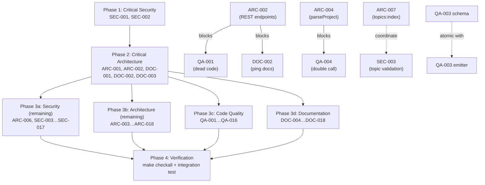

# Project Audit Report

> **Project**: cc2cc (Claude-to-Claude Communication Hub)
> **Date**: 2026-03-22
> **Stack**: TypeScript · Bun · Hono · Redis · Next.js 16 · WebSocket · MCP (stdio)
> **Audited by**: Claude Code Audit System (parallel expert subagents)

---

## Executive Summary

cc2cc is a well-architected hub-and-spoke system with clean module separation, excellent shared-type discipline via `@cc2cc/shared` Zod schemas, and a sound RPOPLPUSH at-least-once delivery design. However, **the at-least-once guarantee is completely broken** because `replayProcessing()` is never called on hub startup, silently discarding any in-flight messages at restart. Four WS action handlers (`set_role`, `subscribe_topic`, `unsubscribe_topic`, `publish_topic`) bypass Zod validation with raw type casts, enabling topic-name injection into Redis keys. On the documentation side, `dashboard/.env.local.example` references entirely wrong environment variable names, silently misconfiguring any developer following the local setup guide. Resolving the 7 critical issues (2 architecture, 2 security, 3 documentation) is the immediate priority; the 22 high-priority findings represent a solid week of follow-on work.

### Issue Count by Severity

| Severity | Architecture | Security | Code Quality | Documentation | Total |
|----------|:-----------:|:--------:|:------------:|:-------------:|:-----:|
| 🔴 Critical | 2 | 2 | 0 | 3 | **7** |
| 🟠 High     | 6 | 5 | 5 | 6 | **22** |
| 🟡 Medium   | 6 | 6 | 6 | 5 | **23** |
| 🔵 Low      | 4 | 5 | 5 | 4 | **18** |
| **Total**   | **18** | **18** | **16** | **18** | **70** |

> Note: Several issues appear in multiple audit domains (e.g. `redis.keys` is flagged by Architecture, Security, and Code Quality). Each such issue is counted once under its primary domain and cross-referenced by ID below.

---

## 🔴 Critical Issues (Resolve Immediately)

### [ARC-001] `replayProcessing()` Never Called — At-Least-Once Delivery Broken

- **Area**: Architecture
- **Location**: `hub/src/index.ts` (missing call), `hub/src/queue.ts:89` (function exists but unused)
- **Description**: `replayProcessing()` is exported and documented as "call this for each instanceId found in the registry on startup," but `hub/src/index.ts` never invokes it. Messages stranded in any `processing:{instanceId}` key during a hub crash or restart are permanently lost.
- **Impact**: The RPOPLPUSH at-least-once delivery guarantee is silently voided. Any message in-flight at hub restart disappears without error to sender or recipient.
- **Remedy**: On startup, after Redis connects, scan for all `processing:*` keys and call `replayProcessing(instanceId)` for each before accepting new connections.

---

### [ARC-002] Missing REST Endpoints — `POST /api/messages`, `POST /api/broadcast`, `GET /api/ping/:id`

- **Area**: Architecture
- **Location**: `hub/src/api.ts` (routes absent), `dashboard/src/lib/api.ts:72,113` (dead callers), `plugin/src/tools.ts:155` (ping calls 404)
- **Description**: `dashboard/src/lib/api.ts` exports `sendMessage` and `sendBroadcast` targeting REST endpoints that don't exist in the hub. The `ping` MCP tool calls `GET /api/ping/:id` which also returns 404. All three functions will fail at runtime.
- **Impact**: The `ping` MCP tool is always broken. Dashboard dead code creates a false REST API surface and will confuse contributors. Cross-references: **QA-001** (dead code), **DOC-003** (docs describe ping as working).
- **Remedy**: Either implement the three missing REST routes in `hub/src/api.ts`, or (for `sendMessage`/`sendBroadcast`) delete the dead functions and document the WS-only path. The `ping` gap must be resolved because it is an active MCP tool.

---

### [SEC-001] Real API Key Present in `.env` and `dashboard/.env.local`

- **Area**: Security
- **Location**: `.env:2,11,15`, `dashboard/.env.local:2`
- **Description**: Both files contain a real high-entropy API key plus personal data (username `probello`, hostname `MacDaddy`, LAN IP `192.168.1.207`). Files are gitignored but exist on disk. No key rotation procedure is documented.
- **Impact**: Anyone gaining read access to the working directory (shared drive, zip export, another local tool) recovers the live API key and gains full hub control: enumerate instances, read queues, broadcast, subscribe/publish to all topics.
- **Remedy**: Add a pre-commit hook checking for the literal key value. Document key rotation procedure in the README. Consider referencing a secrets manager. The `.env.example` should use a clearly fake placeholder (e.g. `your-api-key-here`) rather than a real value.

---

### [SEC-002] API Key Baked into Browser JavaScript Bundle via `NEXT_PUBLIC_*`

- **Area**: Security
- **Location**: `dashboard/Dockerfile:30-36`, `dashboard/src/components/ws-provider/ws-provider.tsx:332`, `dashboard/src/lib/api.ts:13`
- **Description**: `NEXT_PUBLIC_CC2CC_HUB_API_KEY` is embedded in the Next.js static bundle at build time. Any user who opens DevTools or downloads the bundle can read the only credential needed for full hub access.
- **Impact**: Every dashboard visitor can extract the API key and impersonate any plugin instance, enqueue arbitrary messages, or delete registry entries. Cross-references: **SEC-001**.
- **Remedy**: For LAN-only deployments, document prominently that the dashboard must never be internet-exposed. For broader deployment, implement a BFF pattern: the Next.js server holds the key and the browser communicates via authenticated Next.js API routes.

---

### [DOC-001] `.env.local.example` References Wrong Environment Variable Names

- **Area**: Documentation
- **Location**: `dashboard/.env.local.example`
- **Description**: The file declares `NEXT_PUBLIC_HUB_WS_URL` and `NEXT_PUBLIC_HUB_API_KEY`. The dashboard source reads `NEXT_PUBLIC_CC2CC_HUB_WS_URL` and `NEXT_PUBLIC_CC2CC_HUB_API_KEY`. Copying the example verbatim leaves the dashboard silently misconfigured.
- **Impact**: Any developer following local setup instructions will get a non-functional dashboard with no visible error. Cross-references: **SEC-001**.
- **Remedy**: Update `dashboard/.env.local.example` to use the correct `NEXT_PUBLIC_CC2CC_HUB_WS_URL` and `NEXT_PUBLIC_CC2CC_HUB_API_KEY` variable names.

---

### [DOC-002] `ping` Tool Documented as Functional — Will Always Return 404

- **Area**: Documentation
- **Location**: `README.md`, `docs/ARCHITECTURE.md`, `skill/skills/cc2cc/SKILL.md`, `skill/skills/cc2cc/patterns/task-delegation.md`
- **Description**: All four documents describe `ping()` as a usable MCP tool. The `task-delegation.md` pattern instructs Claude to call it for liveness checks. The hub has no `GET /api/ping/:id` route; every call returns 404. Cross-references: **ARC-002**.
- **Impact**: Claude instances following the SKILL.md protocol will call `ping()`, receive a runtime error, and have no guidance on recovery.
- **Remedy**: Either implement `GET /api/ping/:id` in the hub (preferred), or add a prominent "NOT YET IMPLEMENTED" warning to all documentation mentioning `ping()` and remove it from example workflows.

---

### [DOC-003] Docker Quick Start `.env.example` Has Mixed-Context Variables Without Annotation

- **Area**: Documentation
- **Location**: `README.md` (Quick Start — Docker section), `.env.example`
- **Description**: The Quick Start instructs `cp .env.example .env`. The example file contains `CC2CC_REDIS_URL=redis://:changeme@localhost:6379`, which is correct for local dev but wrong for Docker (where Redis is at `redis:6379` inside the compose network). No comments distinguish Docker vs. local dev values.
- **Impact**: New users attempting Docker deployment will copy a partially wrong env file and silently misconfigure Redis connectivity.
- **Remedy**: Add inline comments in `.env.example` annotating which values are Docker-specific vs. local-dev-specific, or provide separate `.env.example.local` and `.env.example.docker` files.

---

## 🟠 High Priority Issues

### Architecture

#### [ARC-003] `instance:session_updated` HubEvent Has No Dashboard Handler

- **Location**: `dashboard/src/components/ws-provider/ws-provider.tsx:179`
- **Description**: The dashboard's `handleEvent` switch covers 12 of 13 `HubEvent` discriminants but has no `case "instance:session_updated"`. The old instance entry lingers as "offline" and the new one is not promoted until a subsequent `instance:joined` event arrives.
- **Impact**: Stale offline duplicates in the instance sidebar; incorrect online/offline counts between `/clear` and reconnect.
- **Remedy**: Add `case "instance:session_updated"` that deletes `oldInstanceId` from the map and upserts `newInstanceId` as online.

#### [ARC-004] `parseProject` Function Duplicated Across Two Hub Modules

- **Location**: `hub/src/registry.ts:17` (private), `hub/src/topic-manager.ts:8` (exported)
- **Description**: Identical function exists in both files. `ws-handler.ts` imports only from `topic-manager.ts`. Cross-references: **QA-004**.
- **Remedy**: Delete the copy in `registry.ts`. Export `parseProject` from a single canonical location (`validation.ts` or `topic-manager.ts`) and import it everywhere.

#### [ARC-005] `keysEqual` Auth Helper Duplicated in `api.ts` and `ws-handler.ts`

- **Location**: `hub/src/api.ts:17`, `hub/src/ws-handler.ts:41`
- **Description**: Security-sensitive timing-safe comparison function copy-pasted verbatim. A fix to one copy may not reach the other.
- **Remedy**: Export `keysEqual` from a shared `hub/src/auth.ts` module; import in both files.

#### [ARC-006] Four WS Action Handlers Bypass Zod Validation (Raw Type Casts)

- **Location**: `hub/src/ws-handler.ts:462,482,498,519`
- **Description**: `handleSetRole`, `handleSubscribeTopic`, `handleUnsubscribeTopic`, and `handlePublishTopic` use direct TypeScript casts instead of `safeParse`. The corresponding schemas (`SetRoleInputSchema`, `SubscribeTopicInputSchema`, etc.) exist in `@cc2cc/shared` but are not used. Cross-references: **SEC-003**, **QA-003**.
- **Impact**: Malformed frames bypass validation; `null`/`undefined` topic names or roles propagate into Redis, corrupting global state.
- **Remedy**: Apply `.safeParse()` in each handler matching the pattern in `handleSendMessage`. Return an error frame on parse failure.

#### [ARC-007] `listTopics()` Uses `redis.keys()` — Blocking O(N) Full Keyspace Scan

- **Location**: `hub/src/topic-manager.ts:65`
- **Description**: `redis.keys("topic:*")` blocks Redis's event loop for the full keyspace scan. Redis documentation explicitly states never use in production. Cross-references: **SEC-005**, **QA-002**.
- **Remedy**: Maintain a Redis Set `topics:index` updated atomically in `createTopic`/`deleteTopic`; replace `KEYS` with `SMEMBERS topics:index`.

#### [ARC-008] In-Memory Registry Not Re-Hydrated from Redis on Startup

- **Location**: `hub/src/registry.ts:15`
- **Description**: The `_map` is populated only from live WS connections. After hub restart, `getAll()` returns empty until plugins reconnect, making `/api/instances` report zero instances.
- **Impact**: Stats and instance listings are wrong immediately after restart; admin operations on recently-offline plugins fail.
- **Remedy**: On startup, scan Redis for `instance:*` keys and populate `_map` with `status: "offline"` entries; WS connect events then promote them to online.

---

### Security

#### [SEC-003] Topic Name Injected Into Redis Keys Without Character-Set Validation

- **Location**: `hub/src/topic-manager.ts:21-65`
- **Description**: Topic names are interpolated directly into Redis keys (`` `topic:${name}` ``, `` `topic:${name}:subscribers` ``) without any character-set restriction. A name like `"x:subscribers"` creates `topic:x:subscribers:subscribers`, overlapping with the real subscriber-set key pattern. Empty or glob-character names cause further corruption.
- **Remedy**: Enforce `/^[a-z0-9][a-z0-9_-]{0,63}$/` on topic names at both the REST endpoint and all WS frame handlers before any Redis operation.

#### [SEC-004] `instanceId` Validation Too Permissive — Allows Redis Key Injection

- **Location**: `hub/src/validation.ts:7`, `hub/src/registry.ts:39,95`, `hub/src/ws-handler.ts:430-438`
- **Description**: `INSTANCE_ID_RE` allows any character except `@` and `:` in most segments. An ID like `user@host:queue:victim/uuid` passes validation, triggers auto-join to a topic named `"queue"`, and creates Redis key `instance:user@host:queue:victim/uuid` which collides with the queue keyspace. The `session_update` schema uses `z.string().min(1)` rather than the full regex.
- **Remedy**: Tighten to `/^[a-zA-Z0-9._-]+@[a-zA-Z0-9._-]+:[a-zA-Z0-9._-]{1,64}\/[a-zA-Z0-9-]{1,64}$/`. Apply the same constraint in `SessionUpdateActionSchema`.

#### [SEC-005] CORS Wildcard (`origin: "*"`) on Hub

- **Location**: `hub/src/index.ts:25-29`
- **Description**: Any origin can make cross-origin requests to the hub REST API. Combined with the API key embedded in the browser bundle, any webpage a LAN user visits can make authenticated REST calls to the hub. Cross-references: **ARC-010**.
- **Remedy**: Restrict `origin` to the dashboard URL via an env var (`CC2CC_DASHBOARD_ORIGIN`). Document the LAN-only deployment constraint prominently.

#### [SEC-006] No Message Content Size Limit — Memory Exhaustion / DoS

- **Location**: `packages/shared/src/schema.ts:31-34`, `hub/src/queue.ts:25`
- **Description**: `content: z.string().min(1)` has no maximum. A single 50 MB message is valid per schema; 1000 such messages in a queue = 50 GB Redis memory. Broadcast fans the same payload to all connected instances simultaneously. Cross-references: **ARC-015**.
- **Remedy**: Add `.max(65536)` (64 KB, configurable via `CC2CC_MAX_MESSAGE_BYTES`) to `content` in `SendMessageInputSchema` and `BroadcastInputSchema`. Add `metadata` depth/byte limits.

#### [SEC-007] Client-Supplied `from` Field Accepted in REST Publish Endpoint

- **Location**: `hub/src/api.ts:250-284`
- **Description**: `POST /api/topics/:name/publish` uses the client-supplied `from` field directly in the message. The WebSocket path correctly server-stamps `from`; the REST path does not.
- **Impact**: Any authenticated caller can publish as any identity (e.g., `from: "trusted-admin-instance"`), misleading receiving instances.
- **Remedy**: Ignore client-supplied `from` in the REST endpoint; stamp it server-side or validate it against the registry.

---

### Code Quality

#### [QA-001] Dead `sendMessage` / `sendBroadcast` Functions in `dashboard/src/lib/api.ts`

- **Location**: `dashboard/src/lib/api.ts:72,113`
- **Description**: Both functions POST to non-existent hub endpoints. The dashboard uses the WS-based path from `WsContext` instead. Cross-references: **ARC-002**.
- **Remedy**: Remove these functions (blocked on ARC-002 decision: implement endpoints or remove dead code).

#### [QA-002] `handlePublishTopic` Rebuilds Full Online-Instance WsRef Map on Every Call

- **Location**: `hub/src/ws-handler.ts:535`, `hub/src/api.ts:263`
- **Description**: Both the WS handler and REST handler independently iterate all online instances and build a fresh `Map<string, WsRef>` before passing it to `topicManager.publishToTopic`. This duplicates boilerplate and creates an O(n) allocation per publish.
- **Remedy**: Add `getOnlineWsRefs(): Map<string, WsRef>` to `registry`; call it from both handlers.

#### [QA-003] `InstanceRoleUpdatedEventSchema` Requires `role: z.string().min(1)` but Hub Emits `role: ""`

- **Location**: `packages/shared/src/events.ts:89`, `hub/src/ws-handler.ts:469`
- **Description**: When a role is cleared, the hub emits `role: updated.role ?? ""`. The schema's `.min(1)` causes `safeParse` to fail and the event is silently dropped by the dashboard, leaving stale role badges displayed indefinitely.
- **Remedy**: Change schema to `z.string()` (allow empty to represent "role cleared"), or enforce non-empty at the API boundary and use a sentinel like `"none"` for clearing.

#### [QA-004] `parseProject` Called Twice on `newInstanceId` in `handleSessionUpdate`

- **Location**: `hub/src/ws-handler.ts:410,441`
- **Description**: `parseProject(newInstanceId)` is assigned to `project` at line 410, then called again identically at line 441. Redundant call.
- **Remedy**: Remove the second call and reuse `project` (or rename it `newProject` at line 410).

#### [QA-005] `sendPublishTopic` in `WsProvider` Has No Fetch Timeout

- **Location**: `dashboard/src/components/ws-provider/ws-provider.tsx:492`
- **Description**: The REST call to `/api/topics/:name/publish` omits `AbortSignal.timeout()`. All other dashboard fetches in `lib/api.ts` use a 10s timeout. This call can hang indefinitely if the hub is unresponsive.
- **Remedy**: Add `signal: AbortSignal.timeout(10_000)` matching the pattern in `lib/api.ts`.

---

### Documentation

#### [DOC-004] No `CHANGELOG.md`

- **Location**: Missing at project root
- **Description**: No version history exists despite the project being at `plugin.json` v0.2.2 / `package.json` v0.1.0. The version skew between the two is unexplained.
- **Remedy**: Create `CHANGELOG.md` (Keep a Changelog format). Reconcile or document the version divergence.

#### [DOC-005] No `CONTRIBUTING.md`

- **Location**: Missing at project root
- **Description**: No contribution guide. Critical nuances (Jest vs `bun test` in dashboard, `make checkall` before commit, plugin version bump requirement) have no canonical home for contributors.
- **Remedy**: Create `CONTRIBUTING.md` covering branch/PR workflow, required checks, the dashboard test caveat, and the plugin version bump requirement.

#### [DOC-006] No `SECURITY.md`

- **Location**: Missing at project root
- **Description**: The project handles a shared API key granting full network access. No formal threat model, known limitations summary, or responsible disclosure channel exists.
- **Remedy**: Create `SECURITY.md` covering the LAN trust boundary, known limitations (no E2E encryption, shared key, fire-and-forget broadcast), and disclosure instructions.

#### [DOC-007] `topicManager` Public Methods Lack JSDoc

- **Location**: `hub/src/topic-manager.ts`
- **Description**: All other hub modules have JSDoc on public functions. `topicManager`'s 9 exported methods have none — notably the `force` parameter on `unsubscribe()` (bypasses project-topic guard) is invisible without reading implementation.
- **Remedy**: Add JSDoc to all `topicManager` methods, especially documenting `force` and `publishToTopic` error conditions.

#### [DOC-008] `plugin.json` Missing `CC2CC_PROJECT` in `optionalEnv`

- **Location**: `skill/.claude-plugin/plugin.json`
- **Description**: `CC2CC_PROJECT` is read by `plugin/src/config.ts` as an optional variable (fallback: `basename(cwd)`) but not declared in the manifest. The plugin UI will not prompt users to set it, and it won't appear in config help.
- **Remedy**: Add `"CC2CC_PROJECT"` to the `optionalEnv` array.

#### [DOC-009] Documentation Style Guide References Wrong Project Name

- **Location**: `docs/DOCUMENTATION_STYLE_GUIDE.md`
- **Description**: The first sentence reads "…standards and best practices for…the **Par Terminal Emulator** project." Clearly copied from another project and not updated.
- **Remedy**: Replace "Par Terminal Emulator" with "cc2cc" or remove the project-specific reference.

---

## 🟡 Medium Priority Issues

### Architecture

| ID | Issue | Location |
|----|-------|----------|
| ARC-009 | `broadcast:sent` feed entry hardcodes `MessageType.task` — misleading type in feed | `ws-provider.tsx:247` |
| ARC-010 | CORS wildcard — see SEC-005 above (cross-listed) | `hub/src/index.ts:25` |
| ARC-011 | `seedTopics` in WsProvider duplicates `hubUrl()` and `fetchTopics()` URL logic | `ws-provider.tsx:124`, `lib/api.ts:7` |
| ARC-012 | `plugin/src/index.ts` (432 lines) conflates MCP bootstrap, tool dispatch, session watching, lifecycle — violates SRP | `plugin/src/index.ts` |
| ARC-013 | `WsProvider` duplicates exponential backoff / reconnect logic for dashboard WS and plugin WS | `ws-provider.tsx:90-155` |
| ARC-014 | Dashboard `@cc2cc/shared` dependency uses `"*"` instead of `"workspace:*"` | `dashboard/package.json:20` |

### Security

| ID | Issue | Location |
|----|-------|----------|
| SEC-008 | API key transmitted as URL query parameter — logged by proxies, browser history, server logs | `hub/src/index.ts:43-44`, plugin/config, ws-provider |
| SEC-009 | `redis.keys()` enables DoS via keyspace exhaustion (see ARC-007 — cross-listed) | `hub/src/topic-manager.ts:65` |
| SEC-010 | No rate limiting on REST API or WS messages (only broadcast has a 5s rate limit) | `hub/src/api.ts`, `ws-handler.ts` |
| SEC-011 | All transport is unencrypted (`ws://`, `http://`) — passive LAN observer reads all messages | `.env:10,14`, `docker-compose.yml:31` |
| SEC-012 | `handleSessionUpdate` has a race-condition window where the connection is associated with neither old nor new identity | `hub/src/ws-handler.ts:395-453` |
| SEC-013 | `listTopics` silently filters malformed Redis topic hashes with no log/alert | `hub/src/topic-manager.ts:71` |

### Code Quality

| ID | Issue | Location |
|----|-------|----------|
| QA-006 | `WsProvider` (542 lines) manages two WS lifecycles, event dispatch, backoff, correlator — God Component | `ws-provider.tsx` |
| QA-007 | `plugin/src/index.ts` declares inline Zod schemas that duplicate and diverge from `@cc2cc/shared` schemas | `plugin/src/index.ts:314` |
| QA-008 | Magic literal `1` for `WebSocket.OPEN` repeated 4× across 3 hub files | `ws-handler.ts:71,257`, `broadcast.ts:71`, `topic-manager.ts:104` |
| QA-009 | `plugin/src/index.ts` top-level `await` on module load — startup failures produce cryptic stack traces | `plugin/src/index.ts:25` |
| QA-010 | `dashboard/src/lib/api.ts` topic functions lack `AbortSignal.timeout()` and Zod response validation | `lib/api.ts:128+` |
| QA-011 | `handlePublishTopic` only in two locations: refactor `getOnlineWsRefs()` to registry (see QA-002) | `ws-handler.ts:535`, `api.ts:263` |

### Documentation

| ID | Issue | Location |
|----|-------|----------|
| DOC-010 | `README.md` Screenshots section is a placeholder ("Coming soon") | `README.md` |
| DOC-011 | `docs/` directory structure does not follow style guide layout; `superpowers/` planning docs co-located without index | `docs/` |
| DOC-012 | No dedicated REST API reference or deployment/ops guide | Missing |
| DOC-013 | No troubleshooting guide for common failure modes | Missing |
| DOC-014 | `ws-handler.ts` comment "Dashboard clients are receive-only in v1" is misleading (dashboard sends via plugin WS) | `ws-handler.ts` |

---

## 🔵 Low Priority / Improvements

### Architecture

- **ARC-015**: Magic number `86400` (24h TTL) appears in 3 files — define a shared `REDIS_TTL_SECONDS` constant
- **ARC-016**: `BroadcastManager` maintains its own `Map<instanceId, WsRef>` redundantly alongside registry — could use `registry.wsRef` directly
- **ARC-017**: `typescript: "latest"` in root `package.json` while workspaces pin `^5.9.3` — floating major version risk
- **ARC-018**: `docker-compose.yml` uses `service_started` not `service_healthy` for Redis dependency ordering

### Security

- **SEC-014**: Missing `X-Content-Type-Options`, `X-Frame-Options`, `Referrer-Policy` headers on hub responses
- **SEC-015**: Missing `Content-Security-Policy`, `X-Frame-Options`, `X-Content-Type-Options` on dashboard (`next.config.ts`)
- **SEC-016**: Docker images use mutable tags (`oven/bun:1`, `oven/bun:1-alpine`) without SHA digest pinning
- **SEC-017**: Redis connection URL embeds password in plaintext — prefer separate host/port/password env vars
- **SEC-018**: `dashboard/.env.local.example` wrong variable names (also covered in DOC-001 Critical)

### Code Quality

- **QA-012**: `eslint-disable-next-line react-hooks/set-state-in-effect` in WsProvider — pattern does not match ESLint expectations
- **QA-013**: `eslint-disable-line react-hooks/purity` for `Date.now()` in `useMemo` — `Date.now()` is impure; use `useRef` on a timer
- **QA-014**: `biome-ignore` on unused `server` constant in `hub/src/index.ts` — implement SIGTERM graceful shutdown or export it
- **QA-015**: Inconsistent WS error response shape — some handlers include `details:`, others don't — create a helper function
- **QA-016**: `_apiKey` parameter in `HubConnection` constructor is received but unused — remove or document

### Documentation

- **DOC-015**: ASCII art workspace layout in `README.md` and `ARCHITECTURE.md` — style guide requires Mermaid diagrams
- **DOC-016**: `reddit-release.md` at project root is a draft community post — move to `docs/internal/`
- **DOC-017**: `SKILL.md` version (`0.1.0`) out of sync with `plugin.json` (`0.2.2`) — document or align
- **DOC-018**: `list_instances()` return type in `SKILL.md` omits `role?` field present in `InstanceInfo` type

---

## Detailed Findings

### Architecture & Design

The hub-and-spoke design is clean and well-layered. The shared package approach (no build step, direct TypeScript imports) is elegant and eliminates schema drift. Key concerns are the silent crash-recovery gap (ARC-001) and the creeping pattern of bypassing Zod validation in newer handlers (ARC-006). The CORS wildcard and in-memory registry are acceptable for LAN-only use but require documentation of the deployment constraint.

The most structurally significant issues for maintainability are:
- The 590-line `ws-handler.ts` and 542-line `ws-provider.tsx` — both are growing God Objects
- `plugin/src/index.ts` conflating 5 distinct responsibilities
- Duplicate logic in `parseProject`, `keysEqual`, and reconnect management

### Security Assessment

The security posture is appropriate for an isolated LAN tool but has significant gaps if the deployment boundary is ever relaxed. The timing-safe key comparison and server-stamped `from` on the WebSocket path are best-practice implementations. The highest-risk issues are the Zod bypass in WS handlers (enabling Redis key injection) and the NEXT_PUBLIC API key (enabling any dashboard user to impersonate plugins).

### Code Quality

Test coverage is moderate (40–60%). The six Bun test files for the hub are strong — they mock Redis faithfully and verify exact command sequences. The four WS action handlers with type-cast bypasses represent the highest-impact correctness gap. The `InstanceRoleUpdatedEventSchema`/emitter mismatch (QA-003) is an existing silent bug affecting role-clearing UX.

### Documentation Review

Documentation quality is above average for an early-stage project. The ARCHITECTURE.md Design Invariants section and the SKILL.md collaboration protocol are particularly strong. The three critical gaps are all correctable in under an hour each: fix the `.env.local.example` variable names, decide on `ping` tool implementation, and clarify the Docker env setup.

---

## Remediation Roadmap

### Immediate Actions (Before Next Deployment)
1. **[DOC-001]** Fix `dashboard/.env.local.example` variable names — 5 minutes
2. **[ARC-001]** Call `replayProcessing()` on hub startup — at-least-once guarantee
3. **[ARC-006]** Apply Zod `safeParse` in the four bypassed WS handlers
4. **[SEC-003]** Add topic name character-set validation before Redis key construction
5. **[ARC-002]** Implement `GET /api/ping/:id` or remove the `ping` MCP tool
6. **[DOC-002]** Update `ping` documentation to reflect current reality
7. **[SEC-006]** Add `content.max(65536)` to message schemas

### Short-term (Next 1–2 Sprints)
1. **[ARC-007]** Replace `redis.keys("topic:*")` with a `topics:index` Redis Set
2. **[SEC-004]** Tighten `INSTANCE_ID_RE` character-set restrictions
3. **[ARC-004/ARC-005]** Extract `parseProject` and `keysEqual` to shared modules
4. **[QA-003]** Fix `InstanceRoleUpdatedEventSchema` / hub emitter mismatch
5. **[ARC-003]** Add `instance:session_updated` handler in dashboard WsProvider
6. **[SEC-007]** Server-stamp `from` in REST publish endpoint
7. Create **CHANGELOG.md**, **CONTRIBUTING.md**, **SECURITY.md**
8. Add JSDoc to `topicManager` public methods

### Long-term (Backlog)
1. Refactor `ws-handler.ts` and `WsProvider` — extract sub-concerns into modules/hooks
2. Implement request-level rate limiting on WS messages and REST endpoints
3. Add `Content-Security-Policy` headers to dashboard `next.config.ts`
4. Re-hydrate in-memory registry from Redis on hub startup
5. Add `AbortSignal.timeout()` to all dashboard fetch calls
6. Migrate REST API key from query param to `Authorization: Bearer` header

---

## Positive Highlights

1. **Excellent shared-type discipline via `@cc2cc/shared`**: The no-build-step TypeScript source package shared across hub, plugin, and dashboard eliminates schema drift. The `HubEvent` discriminated union in `events.ts` with 13 discriminants enables exhaustive compile-time checking without any type casting.

2. **Textbook RPOPLPUSH at-least-once delivery**: `queue.ts` correctly uses atomic RPOPLPUSH to move messages to a `processing:{id}` staging key, with `ackProcessed` on success and `replayProcessing` for crash recovery. The implementation is clean, well-commented, and unit-tested with mock Redis verifying exact command sequences.

3. **Timing-safe API key comparison**: Both `api.ts` and `ws-handler.ts` use `crypto.timingSafeEqual` with a correct length check, preventing timing-oracle attacks on the shared secret.

4. **Server-stamps `from` on WebSocket path**: The hub ignores client-supplied `from` fields on WS messages and stamps them from the server-verified `instanceId`, preventing identity spoofing on the primary messaging path.

5. **Production-quality SKILL.md and pattern files**: The task-delegation, broadcast, result-aggregation, and topics patterns give Claude instances unambiguous operating procedures with message-ID correlation, "do not block" rules, and common mistake enumeration — unusually thorough operational documentation.

6. **Clean hub module separation**: The 8 hub modules (`config`, `redis`, `registry`, `queue`, `broadcast`, `topic-manager`, `ws-handler`, `api`) each have a single coherent responsibility with no circular dependencies.

7. **Proactive documentation of known gaps**: The README explicitly notes the unimplemented `ping` endpoint, the missing `GET /api/messages/:id` stub, and the broadcast fire-and-forget limitation — honest documentation that prevents misuse.

8. **Non-root Docker execution**: The dashboard Dockerfile creates a `nextjs` user (UID 1001) and runs as it, reducing container breakout blast radius.

---

## Audit Confidence

| Area | Files Reviewed | Confidence |
|------|---------------|-----------|
| Architecture | 22 | High |
| Security | 19 | High |
| Code Quality | 20 | High |
| Documentation | 14 | High |

---

## Remediation Plan

> This section is machine-readable and consumed directly by `/fix-audit`.
> Phase assignments and file conflicts are pre-computed to eliminate re-analysis.

### Phase Assignments

#### Phase 1 — Critical Security (Sequential, Blocking)
| ID | Title | File(s) | Severity |
|----|-------|---------|----------|
| SEC-001 | API key in .env — add rotation process + pre-commit guard | `.env.example`, `README.md` | Critical |
| SEC-002 | NEXT_PUBLIC API key — document BFF requirement + deployment warning | `dashboard/Dockerfile`, `README.md` | Critical |

#### Phase 2 — Critical Architecture (Sequential, Blocking)
| ID | Title | File(s) | Severity | Blocks |
|----|-------|---------|----------|--------|
| ARC-001 | Call `replayProcessing()` on hub startup | `hub/src/index.ts`, `hub/src/queue.ts` | Critical | — |
| ARC-002 | Implement `GET /api/ping/:id` or remove dead code | `hub/src/api.ts`, `dashboard/src/lib/api.ts`, `plugin/src/tools.ts` | Critical | QA-001, DOC-002 |
| DOC-001 | Fix `dashboard/.env.local.example` variable names | `dashboard/.env.local.example` | Critical | — |
| DOC-002 | Update `ping` documentation | `README.md`, `skill/skills/cc2cc/SKILL.md`, `skill/skills/cc2cc/patterns/task-delegation.md` | Critical | — |
| DOC-003 | Fix Docker `.env.example` variable annotations | `.env.example`, `README.md` | Critical | — |

#### Phase 3 — Parallel Execution

**3a — Security (remaining)**
| ID | Title | File(s) | Severity |
|----|-------|---------|----------|
| ARC-006 | Apply Zod `safeParse` in four bypassed WS handlers | `hub/src/ws-handler.ts` | High |
| SEC-003 | Topic name character-set validation before Redis keys | `hub/src/topic-manager.ts`, `hub/src/api.ts` | High |
| SEC-004 | Tighten `INSTANCE_ID_RE` + apply in `SessionUpdateActionSchema` | `hub/src/validation.ts`, `packages/shared/src/schema.ts` | High |
| SEC-005 | Restrict CORS `origin` from `"*"` to dashboard URL | `hub/src/index.ts` | High |
| SEC-006 | Add `content.max(65536)` to message schemas | `packages/shared/src/schema.ts` | High |
| SEC-007 | Server-stamp `from` in REST publish endpoint | `hub/src/api.ts` | High |
| SEC-008 | Migrate REST API key from query param to `Authorization` header | `hub/src/api.ts`, `dashboard/src/lib/api.ts` | Medium |
| SEC-010 | Add per-connection WS rate limiting | `hub/src/ws-handler.ts` | Medium |
| SEC-011 | Document TLS requirement for non-LAN deployments | `README.md`, `SECURITY.md` | Medium |
| SEC-012 | Fix `handleSessionUpdate` race condition (register new before deregistering old) | `hub/src/ws-handler.ts` | Medium |
| SEC-013 | Log warning when malformed topic hash filtered in `listTopics` | `hub/src/topic-manager.ts` | Medium |
| SEC-014 | Add security headers to hub responses | `hub/src/index.ts` | Low |
| SEC-015 | Add CSP headers to dashboard `next.config.ts` | `dashboard/next.config.ts` | Low |
| SEC-016 | Pin Docker images to SHA digests | `hub/Dockerfile`, `dashboard/Dockerfile` | Low |
| SEC-017 | Use separate Redis env vars instead of URL-embedded password | `hub/src/config.ts`, `hub/src/redis.ts` | Low |

**3b — Architecture (remaining)**
| ID | Title | File(s) | Severity |
|----|-------|---------|----------|
| ARC-003 | Add `instance:session_updated` case to dashboard WsProvider | `dashboard/src/components/ws-provider/ws-provider.tsx` | High |
| ARC-004 | Deduplicate `parseProject` to shared location | `hub/src/registry.ts`, `hub/src/topic-manager.ts` | High |
| ARC-005 | Extract `keysEqual` to `hub/src/auth.ts` | `hub/src/api.ts`, `hub/src/ws-handler.ts` | High |
| ARC-007 | Replace `redis.keys()` with `topics:index` Redis Set | `hub/src/topic-manager.ts` | High |
| ARC-008 | Re-hydrate in-memory registry from Redis on startup | `hub/src/registry.ts`, `hub/src/index.ts` | High |
| ARC-009 | Add `type` field to `BroadcastSentEventSchema` | `packages/shared/src/events.ts`, `hub/src/ws-handler.ts` | Medium |
| ARC-011 | Replace `seedTopics` inline fetch with `lib/api.ts` helpers | `dashboard/src/components/ws-provider/ws-provider.tsx`, `dashboard/src/lib/api.ts` | Medium |
| ARC-012 | Extract tool dispatch and session watcher from `plugin/src/index.ts` | `plugin/src/index.ts` | Medium |
| ARC-013 | Extract `useReconnectingWs` hook from WsProvider | `dashboard/src/components/ws-provider/ws-provider.tsx` | Medium |
| ARC-014 | Change dashboard `@cc2cc/shared` to `"workspace:*"` | `dashboard/package.json` | Medium |
| ARC-015 | Define `REDIS_TTL_SECONDS` constant | `hub/src/registry.ts`, `hub/src/queue.ts` | Low |
| ARC-017 | Pin root `typescript` to `^5.9.3` | `package.json` | Low |
| ARC-018 | Use `service_healthy` in docker-compose Redis dependency | `docker-compose.yml` | Low |

**3c — Code Quality (all)**
| ID | Title | File(s) | Severity |
|----|-------|---------|----------|
| QA-001 | Remove dead `sendMessage`/`sendBroadcast` from `lib/api.ts` | `dashboard/src/lib/api.ts` | High |
| QA-002 | Add `getOnlineWsRefs()` to registry; eliminate per-publish Map rebuild | `hub/src/registry.ts`, `hub/src/ws-handler.ts`, `hub/src/api.ts` | High |
| QA-003 | Fix `InstanceRoleUpdatedEventSchema` `.min(1)` vs empty-string emitter | `packages/shared/src/events.ts`, `hub/src/ws-handler.ts` | High |
| QA-004 | Remove redundant `parseProject` call at ws-handler.ts:441 | `hub/src/ws-handler.ts` | Medium |
| QA-005 | Add `AbortSignal.timeout(10_000)` to `sendPublishTopic` fetch | `dashboard/src/components/ws-provider/ws-provider.tsx` | Medium |
| QA-006 | Refactor `WsProvider` — extract hooks for each WS lifecycle | `dashboard/src/components/ws-provider/ws-provider.tsx` | Medium |
| QA-007 | Replace inline Zod schemas in `plugin/src/index.ts` with shared imports | `plugin/src/index.ts` | Medium |
| QA-008 | Define `WS_OPEN = 1` constant; remove magic literal | `hub/src/ws-handler.ts`, `hub/src/broadcast.ts`, `hub/src/topic-manager.ts` | Medium |
| QA-009 | Wrap top-level `await` in `plugin/src/index.ts` in `main()` with `.catch()` | `plugin/src/index.ts` | Medium |
| QA-010 | Add `AbortSignal.timeout()` and Zod validation to `lib/api.ts` topic functions | `dashboard/src/lib/api.ts` | Medium |
| QA-011 | Fix `listTopics` to log warning on malformed topic hash | `hub/src/topic-manager.ts` | Medium |
| QA-012 | Fix ESLint disable for `set-state-in-effect` in WsProvider | `dashboard/src/components/ws-provider/ws-provider.tsx` | Low |
| QA-013 | Fix `Date.now()` in `useMemo` — use `useRef` + timer | `dashboard/src/components/activity-timeline/activity-timeline.tsx` | Low |
| QA-014 | Implement SIGTERM handler and remove `biome-ignore` on `server` | `hub/src/index.ts` | Low |
| QA-015 | Standardize WS error response shape via helper function | `hub/src/ws-handler.ts` | Low |
| QA-016 | Remove unused `_apiKey` parameter from `HubConnection` constructor | `plugin/src/connection.ts` | Low |

**3d — Documentation (all)**
| ID | Title | File(s) | Severity |
|----|-------|---------|----------|
| DOC-004 | Create `CHANGELOG.md` | `CHANGELOG.md` (new) | High |
| DOC-005 | Create `CONTRIBUTING.md` | `CONTRIBUTING.md` (new) | High |
| DOC-006 | Create `SECURITY.md` | `SECURITY.md` (new) | High |
| DOC-007 | Add JSDoc to all `topicManager` public methods | `hub/src/topic-manager.ts` | High |
| DOC-008 | Add `CC2CC_PROJECT` to `plugin.json` `optionalEnv` | `skill/.claude-plugin/plugin.json` | High |
| DOC-009 | Fix style guide project name ("Par Terminal Emulator" → "cc2cc") | `docs/DOCUMENTATION_STYLE_GUIDE.md` | High |
| DOC-010 | Add screenshots or remove placeholder section | `README.md` | Medium |
| DOC-011 | Add `docs/README.md` index; mark `superpowers/` as internal | `docs/README.md` (new) | Medium |
| DOC-012 | Extract REST API table to `docs/api/REST_API.md` | `docs/api/REST_API.md` (new) | Medium |
| DOC-013 | Create `docs/guides/TROUBLESHOOTING.md` | `docs/guides/TROUBLESHOOTING.md` (new) | Medium |
| DOC-014 | Fix misleading "receive-only in v1" comment in `ws-handler.ts` | `hub/src/ws-handler.ts` | Medium |
| DOC-015 | Convert ASCII art workspace layouts to Mermaid diagrams | `README.md`, `docs/ARCHITECTURE.md` | Medium |
| DOC-016 | Move `reddit-release.md` to `docs/internal/` | `reddit-release.md` | Low |
| DOC-017 | Document or align `SKILL.md` vs `plugin.json` version | `skill/skills/cc2cc/SKILL.md` | Low |
| DOC-018 | Add `role?` field to `list_instances()` docs in `SKILL.md` | `skill/skills/cc2cc/SKILL.md` | Low |

---

### File Conflict Map

| File | Domains | Issues | Risk |
|------|---------|--------|------|
| `hub/src/ws-handler.ts` | Security + Architecture + Code Quality + Documentation | ARC-006, SEC-012, QA-002, QA-003, QA-004, QA-008, QA-015, DOC-014 | ⚠️ Read before edit |
| `hub/src/topic-manager.ts` | Architecture + Security + Code Quality + Documentation | ARC-007, SEC-003, SEC-013, QA-011, DOC-007 | ⚠️ Read before edit |
| `hub/src/api.ts` | Architecture + Security + Code Quality | ARC-002, ARC-005, SEC-007, SEC-010, QA-002 | ⚠️ Read before edit |
| `hub/src/registry.ts` | Architecture + Code Quality | ARC-004, ARC-008, QA-002 | ⚠️ Read before edit |
| `hub/src/index.ts` | Architecture + Security + Code Quality | ARC-001, ARC-008, SEC-005, QA-014 | ⚠️ Read before edit |
| `dashboard/src/components/ws-provider/ws-provider.tsx` | Architecture + Security + Code Quality | ARC-003, ARC-011, ARC-013, SEC-002, QA-005, QA-006, QA-012 | ⚠️ Read before edit |
| `dashboard/src/lib/api.ts` | Architecture + Code Quality | ARC-002, ARC-011, QA-001, QA-010, SEC-008 | ⚠️ Read before edit |
| `packages/shared/src/schema.ts` | Architecture + Security + Code Quality | SEC-004, SEC-006, QA-003 | ⚠️ Read before edit |
| `packages/shared/src/events.ts` | Architecture + Code Quality | ARC-009, QA-003 | ⚠️ Read before edit |
| `README.md` | Security + Documentation | SEC-001, SEC-002, DOC-002, DOC-003, DOC-010, DOC-015 | ⚠️ Read before edit |

### Blocking Relationships

- **ARC-001** → (none) — must complete before any queue reliability work
- **ARC-002** → **QA-001**: ARC-002 decides whether REST endpoints are added or removed; QA-001's remedy depends on that decision
- **ARC-002** → **DOC-002**: Can only correctly document `ping` once the implementation decision is made
- **ARC-004** → **QA-004**: Moving `parseProject` changes the import in `ws-handler.ts`; QA-004's line references become invalid
- **ARC-007** → **SEC-003**: Adding `topics:index` set changes `createTopic`/`deleteTopic` — SEC-003's validation touches same functions; coordinate edits
- **QA-003** → (schema fix must be atomic with emitter fix): change `events.ts` schema and `ws-handler.ts` emitter in the same commit to avoid a window where valid events are dropped

### Dependency Diagram

