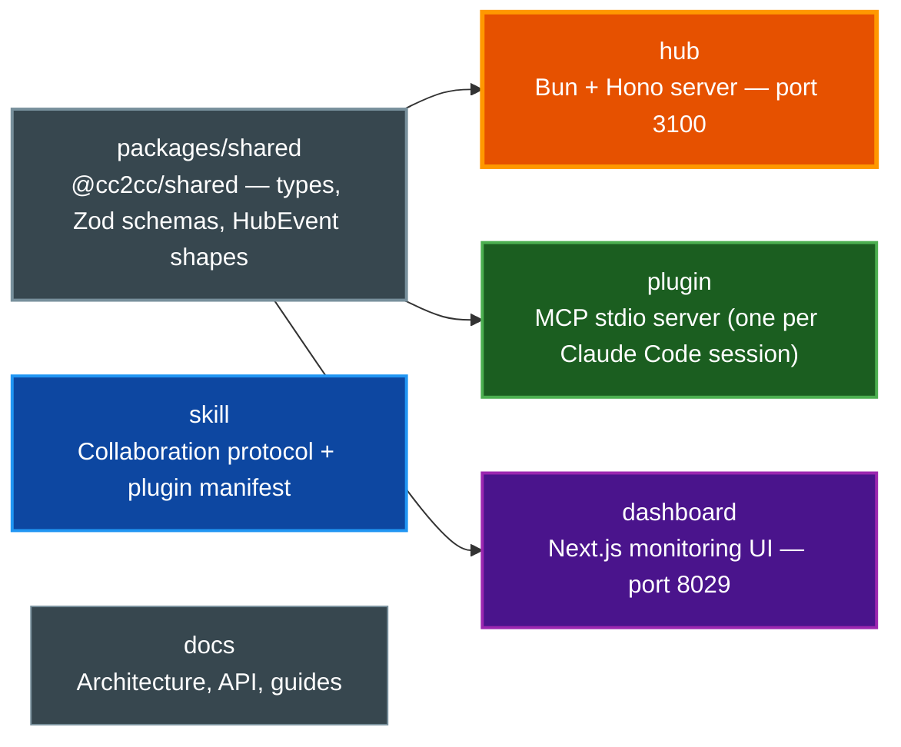
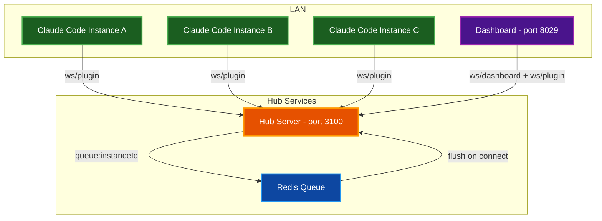
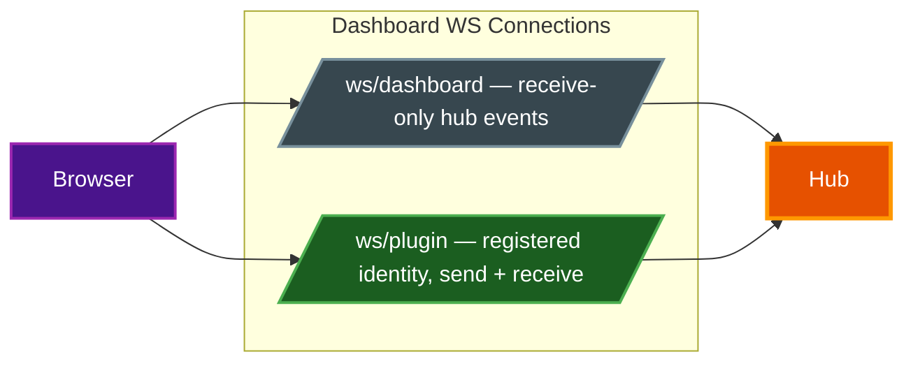
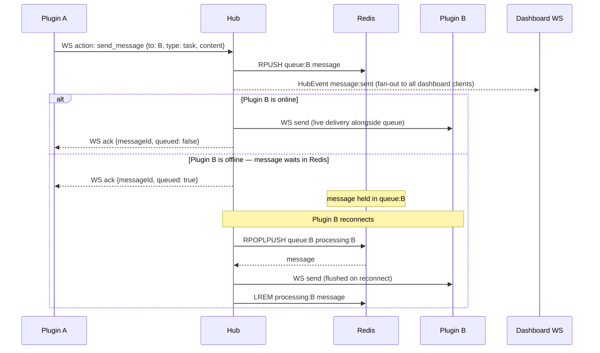

# cc2cc Architecture

Comprehensive technical reference for the cc2cc hub-and-spoke communication system — covering workspace layout, component responsibilities, message flow, protocol details, and key design invariants.

## Table of Contents

- [Overview](#overview)
- [Workspace Layout](#workspace-layout)
- [System Diagram](#system-diagram)
- [Components](#components)
  - [packages/shared](#packagesshared)
  - [hub](#hub)
  - [plugin](#plugin)
  - [dashboard](#dashboard)
  - [skill](#skill)
- [Message Flow](#message-flow)
- [WebSocket Protocol](#websocket-protocol)
  - [Plugin WebSocket Actions](#plugin-websocket-actions)
  - [Dashboard WebSocket Events](#dashboard-websocket-events)
- [REST API](#rest-api)
- [Queue Architecture](#queue-architecture)
- [Design Invariants](#design-invariants)
- [Related Documentation](#related-documentation)

---

## Overview

cc2cc is a hub-and-spoke messaging system. A central hub server accepts WebSocket connections from two client types — *plugins* (one per Claude Code session) and *dashboards* — and routes typed messages between them through per-instance Redis queues.

The system is designed for trusted LAN environments where multiple Claude Code instances collaborate on shared work. It is **not** an encrypted messaging system and assumes physical network trust.

---

## Workspace Layout



---

## System Diagram



---

## Components

### packages/shared

**Purpose:** Central source of truth for all types and validation schemas, shared by every other workspace.

No build step — all other workspaces import directly from TypeScript source via the `@cc2cc/shared` path alias.

| Module | Contents |
|--------|----------|
| `src/types.ts` | `MessageType` enum, `Message` interface, `InstanceInfo` interface (with optional `role` field), `TopicInfo` interface |
| `src/schema.ts` | Zod schemas for all message shapes and MCP tool inputs; uses `z.nativeEnum(MessageType)` for enum alignment |
| `src/events.ts` | `HubEvent` discriminated union — all event types emitted to dashboard clients, including topic and role events |

> **Note:** Zod version is pinned to `^3`. Do not upgrade to v4 — it is incompatible with the shared schemas.

---

### hub

**Purpose:** Central routing server. Accepts plugin and dashboard WebSocket connections, routes messages through Redis queues, and fans out HubEvents to all dashboard clients.

| Module | Responsibility |
|--------|---------------|
| `index.ts` | Entry point; Bun + Hono server setup, WS upgrade routing for `/ws/plugin` and `/ws/dashboard`, CORS |
| `config.ts` | Environment: `CC2CC_HUB_PORT` (3100), `CC2CC_HUB_API_KEY` (required), `CC2CC_REDIS_URL` |
| `registry.ts` | In-memory `Map` of live connections + Redis presence TTLs (24 h); partial address resolution |
| `queue.ts` | RPOPLPUSH-based at-least-once delivery; max 1000 msgs/queue; daily stats counter (`stats:messages:today`) with EXPIREAT midnight UTC; queue migration for session updates |
| `broadcast.ts` | `BroadcastManager`: in-memory fan-out + per-instance 5 s rate limiter |
| `topic-manager.ts` | Pub/sub topic lifecycle (create, delete, subscribe, unsubscribe, publish); persistent topic messages queued to offline subscribers; project topic auto-joined on connect |
| `ws-handler.ts` | Plugin/dashboard WS lifecycle; message routing; emits `HubEvent` to `dashboardClients` set; handles 8 WS actions |
| `api.ts` | REST handlers; `GET /health` is the only unauthenticated endpoint; all others require `?key=` |
| `redis.ts` | Redis client setup (ioredis) and health check helper |
| `validation.ts` | Shared validation constants (e.g. `INSTANCE_ID_RE`) |

---

### plugin

**Purpose:** MCP stdio server that connects to the hub and exposes ten Claude Code tools. One instance runs per Claude Code session.

| Module | Responsibility |
|--------|---------------|
| `config.ts` | Assembles `instanceId` from env vars; reads Claude session ID from `.claude/.cc2cc-session-id` (written by `SessionStart` hook), falling back to random UUIDv4 |
| `connection.ts` | `HubConnection`: WS client using the `ws` package; exponential backoff (1 s → ×2 → 30 s max); `request()` method with 10 s timeout |
| `channel.ts` | Converts hub `message:sent` events into `notifications/claude/channel` MCP notifications with `source: "cc2cc"` in meta |
| `tools.ts` | Ten MCP tools — `list_instances`, `send_message`, `broadcast`, `get_messages`, `ping`, `set_role`, `subscribe_topic`, `unsubscribe_topic`, `list_topics`, `publish_topic`. **Note:** The `ping` tool calls `GET /api/ping/:id` which is not yet implemented on the hub; it will return 404 |

**Instance ID format:**

```
username@host:project/sessionId
```

The `sessionId` is the Claude Code session ID — stable within a session, updated automatically on `/clear`. The plugin detects the new ID via a `SessionStart` hook and migrates queued messages to the new identity.

---

### dashboard

**Purpose:** Real-time monitoring UI. A full participant in the cc2cc network with its own registered plugin identity.



The dashboard registers under:

```
dashboard@<hostname>:dashboard/<uuid>
```

The UUID is generated once per browser session (stored in `sessionStorage`) and is stable across page re-renders but fresh on each new tab.

`sendMessage` and `sendBroadcast` go through the plugin WS connection. `sendPublishTopic` goes through REST (`POST /api/topics/:name/publish`) to avoid requiring the dashboard's plugin WS identity for topic operations.

| Module | Responsibility |
|--------|---------------|
| `WsProvider` | Single context providing both WS connections; accumulates `instances` Map, `topics` Map, `feed[]` (capped at 500), counters; dispatches all `HubEvent` types |
| `app/page.tsx` | Command Center: stats bar, instance sidebar, feed filter bar, live message feed, manual send bar |
| `app/topics/page.tsx` | Topics management: topic list + create/delete, subscriber list + subscribe/unsubscribe, publish panel |
| `app/analytics/page.tsx` | Stats bar + activity timeline |
| `app/conversations/page.tsx` | Thread-grouped conversation view + message inspector |
| `lib/api.ts` | Typed fetch wrappers for hub REST; `AbortSignal.timeout(10_000)` on all calls; topic wrappers: `fetchTopics`, `createTopic`, `deleteTopic`, `subscribeToTopic`, `unsubscribeFromTopic` |

---

### skill

**Purpose:** Claude Code plugin providing the collaboration protocol and MCP tool access.

Install via: `claude plugin add ./skill`

The skill includes:
- `skills/cc2cc/SKILL.md` — collaboration protocol documentation loaded into Claude Code context
- `.claude-plugin/plugin.json` — plugin manifest with metadata, required/optional env vars
- `.mcp.json` — MCP server definition pointing to `plugin/src/index.ts`
- `skills/cc2cc/patterns/` — reusable patterns: task delegation, broadcast, result aggregation, and topics
- `hooks/` — `SessionStart` hook that writes the Claude session ID to `.claude/.cc2cc-session-id` for stable instance identity

---

## Message Flow

The following diagram traces a message from Plugin A to Plugin B, showing how the hub, Redis, and dashboard interact at each step.



---

## WebSocket Protocol

All WebSocket connections authenticate via query parameter: `?key=<CC2CC_HUB_API_KEY>`. Authorization headers are not supported (Bun WS upgrade does not allow them).

### Plugin WebSocket Actions

Plugins connect to `/ws/plugin?key=<KEY>&instanceId=<ID>`.

All frames are JSON objects with an `action` field. Every request frame carries a `requestId` that the hub echoes in the ack — the plugin's `conn.request()` method uses this to match responses.

| Action | Payload | Ack |
|--------|---------|-----|
| `send_message` | `{ to, type, content, replyToMessageId?, metadata?, requestId }` | `{ requestId, messageId, queued, warning? }` |
| `broadcast` | `{ type, content, metadata?, requestId }` | `{ requestId, delivered }` |
| `get_messages` | `{ limit?, requestId }` | `{ requestId, messages[] }` |
| `session_update` | `{ newInstanceId, requestId }` | `{ requestId, migrated }` |
| `set_role` | `{ role, requestId }` | `{ requestId, instanceId, role }` |
| `subscribe_topic` | `{ topic, requestId }` | `{ requestId, topic, subscribed: true }` |
| `unsubscribe_topic` | `{ topic, requestId }` | `{ requestId, topic, unsubscribed: true }` or `{ requestId, error }` |
| `publish_topic` | `{ topic, type, content, persistent?, metadata?, requestId }` | `{ requestId, delivered, queued }` |

Inbound messages from the hub arrive as MCP `notifications/claude/channel` notifications:

```xml
<channel source="cc2cc" from="alice@server:api/uuid" type="task" message_id="abc123" reply_to="">
  Message body here
</channel>
```

### Dashboard WebSocket Events

Dashboards connect to `/ws/dashboard?key=<KEY>` and receive a stream of `HubEvent` objects. All events include a `timestamp` (ISO 8601) field.

| Event | Payload | Trigger |
|-------|---------|---------|
| `instance:joined` | `{ instanceId, timestamp }` | Plugin connects |
| `instance:left` | `{ instanceId, timestamp }` | Plugin disconnects |
| `instance:removed` | `{ instanceId, timestamp }` | Instance deleted via `DELETE /api/instances/:id` |
| `instance:session_updated` | `{ oldInstanceId, newInstanceId, migrated, timestamp }` | Plugin session ID changes (e.g. `/clear`) |
| `instance:role_updated` | `{ instanceId, role, timestamp }` | Instance calls `set_role` |
| `message:sent` | `{ message, timestamp }` | Direct message routed by the hub |
| `broadcast:sent` | `{ from, content, timestamp }` | Broadcast sent to all online instances |
| `queue:stats` | `{ instanceId, depth, timestamp }` | Queue depth change for an instance |
| `topic:created` | `{ name, createdBy, timestamp }` | New topic created |
| `topic:deleted` | `{ name, timestamp }` | Topic deleted |
| `topic:subscribed` | `{ name, instanceId, timestamp }` | Instance subscribes to a topic |
| `topic:unsubscribed` | `{ name, instanceId, timestamp }` | Instance unsubscribes from a topic |
| `topic:message` | `{ name, message, persistent, delivered, queued, timestamp }` | Message published to a topic |

---

## REST API

All endpoints require `?key=<CC2CC_HUB_API_KEY>` except `GET /health`.

| Method | Path | Description |
|--------|------|-------------|
| `GET` | `/health` | Health check — no auth required |
| `GET` | `/api/instances` | List all registered instances with status and queue depth |
| `GET` | `/api/stats` | Current message stats (total today, active instances, queued messages) |
| `GET` | `/api/messages/:id` | Stub — returns 404; use the WS event stream to build a local message index |
| `DELETE` | `/api/instances/:id` | Remove an offline instance and flush its queue; returns 409 if instance is online |
| `DELETE` | `/api/queue/:id` | Flush an instance's Redis queue without removing the registry entry |
| `GET` | `/api/topics` | List all topics with subscriber counts |
| `POST` | `/api/topics` | Create a topic (idempotent) |
| `DELETE` | `/api/topics/:name` | Delete a topic; returns 409 if it has subscribers |
| `GET` | `/api/topics/:name/subscribers` | List subscribers for a topic |
| `POST` | `/api/topics/:name/subscribe` | Subscribe an instance to a topic |
| `POST` | `/api/topics/:name/unsubscribe` | Unsubscribe an instance from a topic |
| `POST` | `/api/topics/:name/publish` | Publish a message to a topic |

> **Note:** There are no REST endpoints for `send_message`, `broadcast`, or `ping`. All direct message delivery and identity-dependent operations go through the plugin WebSocket connection. The Topics API is available via both REST and WS.

---

## Queue Architecture

Each instance has two Redis keys:

| Key | Purpose |
|-----|---------|
| `queue:{instanceId}` | Pending messages waiting for delivery |
| `processing:{instanceId}` | In-flight messages being delivered (RPOPLPUSH target) |

**Delivery flow:**

1. Sender submits `send_message` → hub `RPUSH queue:B message`
2. If B is online, hub also delivers the message live over WS (message remains in queue)
3. On reconnect, hub flushes the queue: `RPOPLPUSH queue:B processing:B`, sends over WS, then `LREM processing:B message`
4. On hub crash/restart, `replayProcessing` moves `processing:B` back to `queue:B`

**Limits:**

- Max 1 000 messages per queue
- Queue TTL: 24 h
- Broadcast is fire-and-forget — offline instances do not receive broadcast messages
- Broadcast rate limit: 1 per source instance per 5 seconds

---

## Design Invariants

These invariants hold across the entire system. Violating any of them will break routing, delivery, or security guarantees.

**Instance IDs are ephemeral.**
Each plugin start generates a new session-based ID. Never cache full instance IDs across sessions — always call `list_instances()` to get current IDs before sending.

**`from` is server-stamped.**
The hub ignores any `from` field in client frames and stamps it from the sender's registered identity. Clients cannot spoof each other's identity.

**`broadcast` is routing, not a message type.**
`MessageType` enum values are `task | result | question | ack | ping`. Broadcast fan-out is triggered when `message.to === 'broadcast'`, not by a dedicated type.

**WebSocket auth is query-param only.**
Both `/ws/plugin` and `/ws/dashboard` authenticate via `?key=<CC2CC_HUB_API_KEY>`. Authorization headers are not used.

**Queue delivery is at-least-once.**
The RPOPLPUSH pattern ensures a message is never lost between "popped from queue" and "acked by recipient". Crash recovery replays the `processing:` key.

**Broadcast is fire-and-forget.**
Messages sent to `to: 'broadcast'` fan out over live WS connections only — not queued. Offline instances will not receive them.

**All message delivery is WebSocket-only.**
There are no REST endpoints for `send_message`, `broadcast`, or `ping`. The hub's REST API is for metadata (instance list, stats, remove), topic management, and topic publishing only.

---

## Related Documentation

- [README.md](../README.md) — Quick start, configuration, and installation
- [Documentation Style Guide](DOCUMENTATION_STYLE_GUIDE.md) — Standards for all project documentation
- [cc2cc Skill](../skill/skills/cc2cc/SKILL.md) — Full collaboration protocol for Claude Code instances
- [Task Delegation Pattern](../skill/skills/cc2cc/patterns/task-delegation.md) — How to delegate work to peer instances
- [Broadcast Pattern](../skill/skills/cc2cc/patterns/broadcast.md) — When and how to use broadcast messaging
- [Result Aggregation Pattern](../skill/skills/cc2cc/patterns/result-aggregation.md) — Collecting results from multiple peers
- [Topics Pattern](../skill/skills/cc2cc/patterns/topics.md) — Pub/sub topic messaging between instances
