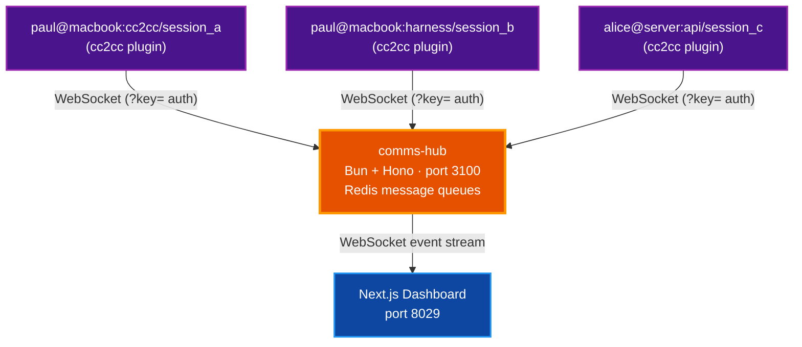

# cc2cc — Claude-to-Claude Communications System

Design specification for the cc2cc hub-and-spoke messaging system. Covers architecture, component design, REST/WebSocket APIs, and deployment.

**Date:** 2026-03-21
**Status:** Approved
**Author:** Paul Robello

## Table of Contents

- [Overview](#overview)
- [Architecture](#architecture)
- [Technology Stack](#technology-stack)
- [Monorepo Structure](#monorepo-structure)
- [Component Designs](#component-designs)
  - [Hub](#1-hub-hub)
  - [MCP Plugin](#2-mcp-plugin-plugin)
  - [Skill](#3-skill-skill)
  - [Dashboard](#4-dashboard-dashboard)
- [Docker Compose](#docker-compose)
- [Security](#security)
- [Out of Scope (v1)](#out-of-scope-v1)

---

## Overview

cc2cc is a Claude-to-Claude communications system that enables multiple Claude Code instances to exchange typed messages in real time. It consists of four components in a Bun monorepo: a central hub server, an MCP plugin (installed in each Claude Code session), a collaboration skill, and a Next.js monitoring dashboard.

---

## Architecture



**Instance ID format:** `username@host:project/session_uuid`
- `username` — `$USER` or `CC2CC_USERNAME`
- `host` — `$HOSTNAME` or `CC2CC_HOST`
- `project` — cwd basename or `CC2CC_PROJECT`
- `session_uuid` — UUIDv4, generated fresh on each plugin start in `config.ts`

---

## Technology Stack

All packages pinned to **latest stable at time of implementation**. Do not copy versions from this document — resolve them with `bun add` at scaffold time.

| Component | Runtime | Key Packages |
|-----------|---------|-------------|
| hub | Bun | hono (latest), ioredis (latest) |
| plugin | Bun | @modelcontextprotocol/sdk (latest) |
| dashboard | Bun / Next.js | next (latest stable), tailwindcss (latest), shadcn/ui |
| shared | Bun build | zod (latest stable 3.x), typescript (latest stable) |

> **Note on Zod:** Pin to the latest **3.x** release. Zod 4.x is in alpha/RC and should not be used in production shared packages until it reaches stable.

---

## Monorepo Structure

```
cc2cc/
├── packages/shared/          # @cc2cc/shared — types, zod schemas, WS event shapes
│   └── src/
│       ├── types.ts          # InstanceId, Message, MessageType enum
│       ├── schema.ts         # zod validation schemas
│       └── events.ts         # WebSocket event shapes (hub → clients)
├── hub/                      # Bun + Hono server — port 3100
│   └── src/
│       ├── index.ts          # entry point
│       ├── config.ts         # env config (CC2CC_HUB_PORT, CC2CC_HUB_API_KEY, CC2CC_REDIS_URL)
│       ├── registry.ts       # instance registration & presence
│       ├── queue.ts          # Redis message queue operations
│       ├── ws-handler.ts     # WebSocket connection management (plugin + dashboard)
│       ├── broadcast.ts      # fire-and-forget fan-out
│       ├── topic-manager.ts  # pub/sub topic management
│       ├── redis.ts          # Redis client & health check
│       ├── validation.ts     # shared request validation helpers
│       └── api.ts            # REST endpoints (health, admin, topics)
├── plugin/                   # MCP server — stdio transport
│   └── src/
│       ├── index.ts          # MCP server entry, capability declaration
│       ├── connection.ts     # hub WebSocket client + reconnect logic
│       ├── tools.ts          # MCP tool handlers
│       ├── channel.ts        # inbound message → Claude channel notification
│       └── config.ts         # env config (hub URL, api key, instance id, uuid)
├── dashboard/                # Next.js — port 8029
│   └── src/
│       ├── app/
│       │   ├── page.tsx          # Command Center (View A — default)
│       │   ├── analytics/        # Analytics View (B)
│       │   ├── conversations/    # Conversation View (C)
│       │   └── topics/           # Topics View (D)
│       └── components/
│           ├── instance-sidebar/ # live instance list with online/offline status
│           ├── message-feed/     # real-time typed message stream
│           └── ws-provider/      # WebSocket context, reconnect with backoff
├── skill/                    # Claude Code skill
│   ├── cc2cc.md              # main skill file
│   └── patterns/
│       ├── task-delegation.md
│       ├── broadcast.md
│       └── result-aggregation.md
├── docker-compose.yml        # hub + redis + dashboard (production-like)
├── docker-compose.dev.yml    # redis only (dev: run hub & dashboard natively)
├── package.json              # bun workspace root
└── Makefile                  # build · test · lint · fmt · typecheck · checkall
```

---

## Component Designs

### 1. Hub (`hub/`)

**Deployment:** Docker (production), native Bun (development). LAN-accessible.
**Port:** 3100

#### WebSocket Authentication

The hub exposes two WebSocket upgrade paths:

**`/ws/plugin`** — for MCP plugin connections (Bun subprocess, not a browser)
- Auth via query parameter: `ws://hub:3100/ws/plugin?key=<api_key>`
- Hub extracts and validates `req.query.key` on upgrade; returns 401 if invalid

**`/ws/dashboard`** — for the Next.js dashboard (browser client)
- Auth via query parameter: `ws://hub:3100/ws/dashboard?key=<api_key>`
- The API key is stored in `NEXT_PUBLIC_CC2CC_HUB_API_KEY`. This makes it visible in the browser bundle — acceptable for LAN-only deployment where the network is trusted, but should be noted explicitly. Do not use this pattern for public deployments.

> **Why not `Sec-WebSocket-Protocol` header?** The plugin is a Bun subprocess (not a browser) so query-param auth is simpler and more robust. Browsers support query params on WebSocket URLs without restriction, so the dashboard can use the same pattern. The `Sec-WebSocket-Protocol` approach is fragile when the key contains special characters and adds parsing complexity with no security benefit on a trusted LAN.

#### Registration Flow

1. Plugin opens WebSocket to `ws://hub:3100/ws/plugin?key=<api_key>`
2. Hub validates key; rejects with 401 if invalid
3. Hub registers instance (`username@host:project/session_uuid`) in the in-memory registry and sets Redis key `instance:{id}` with 24h TTL
4. Hub performs **atomic queue flush** (see Delivery Guarantees below) — replays all pending messages to the plugin before the connection enters live mode
5. Hub broadcasts `instance:joined` to all dashboard WebSocket clients
6. On disconnect: marks instance offline in registry, keeps Redis queue alive (TTL continues), broadcasts `instance:left`

#### Message Delivery

```
send_message(to, type, content, replyToMessageId?)
  → validate API key (already done at WS level)
  → stamp from = registered instanceId of the sending WS connection
      (any client-supplied "from" field is ignored — prevents spoofing)
  → RPUSH queue:{to} <envelope JSON>
  → EXPIRE queue:{to} 86400  (reset TTL on every push)
  → if queue depth > 1000: LPOP queue:{to}  (drop oldest, enforce max depth)
  → INCR stats:messages:today  (Redis counter, expires at midnight UTC)
  → if recipient WS is live: immediately deliver via WebSocket (best-effort)
  → broadcast message:sent event to all dashboard clients
```

#### Delivery Guarantees

**Queue flush on reconnect is at-least-once.** The hub uses `RPOPLPUSH` to atomically move messages from `queue:{id}` to `processing:{id}` before sending over WebSocket. After the plugin acknowledges receipt (or the socket confirms send), the hub deletes the entry from `processing:{id}`. On hub restart, any entries in `processing:{id}` are re-queued to `queue:{id}` and re-delivered.

Callers should design for idempotent handling — a `result` message received twice should be safe to process twice (same `messageId` can be deduplicated by the receiver).

#### Queue Limits

| Parameter | Value |
|-----------|-------|
| TTL per queue | 24h, reset on every RPUSH |
| Max queue depth | 1000 messages per instance |
| Overflow policy | Drop oldest (LPOP) when depth > 1000 |

#### Broadcast Dispatch

Broadcasts are **fire-and-forget** — they are **not queued in Redis** and are **not delivered to offline instances**. The hub detects `to === 'broadcast'` and fans out directly over all active plugin WebSocket connections except the sender's. Rate limit: one broadcast per instance per 5 seconds (enforced in hub, returns 429 error to plugin if exceeded).

#### WebSocket Events (hub → dashboard)

```ts
{ event: 'instance:joined',         instanceId: string, timestamp: string }
{ event: 'instance:left',           instanceId: string, timestamp: string }
{ event: 'instance:removed',        instanceId: string, timestamp: string }
{ event: 'instance:session_updated', oldInstanceId: string, newInstanceId: string, migrated: number, timestamp: string }
{ event: 'instance:role_updated',   instanceId: string, role: string, timestamp: string }
{ event: 'message:sent',            message: Message, timestamp: string }
{ event: 'broadcast:sent',          from: string, content: string, timestamp: string }
{ event: 'queue:stats',             instanceId: string, depth: number, timestamp: string }
{ event: 'topic:created',           name: string, createdBy: string, timestamp: string }
{ event: 'topic:deleted',           name: string, timestamp: string }
{ event: 'topic:subscribed',        name: string, instanceId: string, timestamp: string }
{ event: 'topic:unsubscribed',      name: string, instanceId: string, timestamp: string }
{ event: 'topic:message',           name: string, message: Message, persistent: boolean, delivered: number, queued: number, timestamp: string }
```

#### REST Endpoints

All REST endpoints except `/health` require `?key=<api_key>` — same shared key as WebSocket auth. Destructive admin operations are still auth-enforced even on a trusted LAN.

```
GET    /health                          → { status, connectedInstances, redisOk, uptime }         (no auth)
GET    /api/instances                   → list all instances (online + offline) with status field  (requires ?key=)
GET    /api/stats                       → { messagesToday, activeInstances, queuedTotal }          (requires ?key=)
GET    /api/messages/:id                → stub — returns 404 in v1; use WS event stream           (requires ?key=)
DELETE /api/instances/:id               → remove offline instance from registry                    (requires ?key=)
DELETE /api/queue/:id                   → flush a queue (admin)                                    (requires ?key=)
GET    /api/topics                      → list all topics                                          (requires ?key=)
GET    /api/topics/:name/subscribers    → list subscribers for a topic                             (requires ?key=)
POST   /api/topics                      → create topic (idempotent)                                (requires ?key=)
DELETE /api/topics/:name                → delete topic (fails if subscribers exist)                (requires ?key=)
POST   /api/topics/:name/subscribe      → subscribe an instance to a topic                         (requires ?key=)
POST   /api/topics/:name/unsubscribe    → unsubscribe an instance from a topic                     (requires ?key=)
POST   /api/topics/:name/publish        → publish a message to all topic subscribers               (requires ?key=)
```

> `GET /api/instances` returns **both online and offline instances** with a `status: 'online' | 'offline'` field. This allows the dashboard and skill to address offline peers by instance ID.

#### Configuration (`.env`)

```
CC2CC_HUB_PORT=3100
CC2CC_HUB_API_KEY=<shared secret>
CC2CC_REDIS_URL=redis://localhost:6379
```

---

### 2. MCP Plugin (`plugin/`)

**Transport:** stdio (Claude Code spawns as subprocess)
**Capabilities:** `experimental['claude/channel']` (inbound push) + `tools` (outbound calls)

> **Note on `claude/channel`:** This is a Claude Code-specific capability declared under `capabilities.experimental['claude/channel']: {}`. It is not part of the base MCP specification. It registers a notification listener in Claude Code that surfaces `notifications/claude/channel` events as `<channel>` XML tags in the session context. Requires Claude Code v2.1.80+ and the `--dangerously-load-development-channels` flag during development. See [Claude Code Channels Reference](https://code.claude.com/docs/en/channels-reference).

#### Plugin Configuration

```
CC2CC_HUB_URL      ws://192.168.1.10:3100   # hub WebSocket URL (LAN IP)
CC2CC_API_KEY      <shared key>              # must match hub HUB_API_KEY
CC2CC_USERNAME     paul                      # falls back to $USER
CC2CC_HOST         macbook                   # falls back to $HOSTNAME
CC2CC_PROJECT      cc2cc                     # falls back to cwd basename
```

Instance ID assembled in `config.ts` at startup: `${username}@${host}:${project}/${uuidv4()}`

#### Capability Declaration

```ts
const mcp = new Server(
  { name: 'cc2cc', version: '0.1.0' },
  {
    capabilities: {
      experimental: { 'claude/channel': {} },  // Claude Code-specific: enables inbound channel push
      tools: {},                                 // standard MCP: enables outbound tool calls
    },
    instructions: `
      You are connected to the cc2cc hub. Messages from other Claude instances arrive as
      <channel source="cc2cc" from="..." type="..." message_id="..."> tags.
      Use the cc2cc skill to handle inbound messages and collaborate with peers.
    `,
  },
)
```

#### Inbound Delivery

When the hub delivers a message over the plugin WebSocket, the plugin emits a `notifications/claude/channel` notification:

```ts
await mcp.notification({
  method: 'notifications/claude/channel',
  params: {
    content: message.content,
    meta: {
      from: message.from,
      type: message.type,
      message_id: message.messageId,
      reply_to: message.replyToMessageId ?? '',
    },
  },
})
```

Claude Code renders this as:

```xml
<channel source="cc2cc" from="alice@server:api/xyz" type="task" message_id="abc123" reply_to="">
  Can you review the auth module and report back?
</channel>
```

#### MCP Tools

```ts
list_instances()
  // Returns: { instanceId, project, status: 'online'|'offline', connectedAt, queueDepth }[]

send_message(to: string, type: MessageType, content: string, replyToMessageId?: string, metadata?: object)
  // Returns: { messageId, queued: boolean, warning?: string }
  // warning is set when target is offline ("message queued, recipient offline")

broadcast(type: MessageType, content: string, metadata?: object)
  // Fire-and-forget to all online instances except self
  // Returns: { delivered: number }
  // Errors with 429 if called more than once per 5 seconds

get_messages(limit?: number)
  // Destructive pull: LPOP up to `limit` messages from own queue (default 10)
  // Returns: Message[]
  // Use as polling fallback only — live delivery is via WebSocket channel notifications

ping(to: string)
  // Returns: { online: boolean, latency?: number }
```

#### Message Types (`MessageType` enum)

```ts
enum MessageType {
  task      = 'task',       // delegate a unit of work
  result    = 'result',     // return output from a task
  question  = 'question',   // ask a targeted question
  ack       = 'ack',        // acknowledge receipt / acceptance
  ping      = 'ping',       // liveness check
  // note: 'broadcast' is NOT a MessageType value — routing is determined by to='broadcast'
  // the broadcast() tool always uses one of the above types (typically task or result)
  // with the hub fanning out based on to==='broadcast', not on the type field
}
```

#### Message Envelope (`@cc2cc/shared`)

```ts
interface Message {
  messageId: string               // UUIDv4
  from: string                    // sender instanceId
  to: string | 'broadcast'        // recipient instanceId or 'broadcast'
  type: MessageType
  content: string
  replyToMessageId?: string       // correlates result/ack back to originating task/question
  metadata?: Record<string, unknown>
  timestamp: string               // ISO 8601
}
```

#### Queue Flush on Connect

On successful registration, the hub atomically flushes the instance's pending queue (RPOPLPUSH → deliver → delete from processing list). Claude receives queued messages as a burst of channel notifications before session interaction begins. The skill guides Claude to drain this queue before responding to the user.

#### WebSocket Reconnect

The plugin uses exponential backoff reconnect: initial delay 1s, multiplier 2x, max 30s. Reconnect indefinitely — the hub will flush the queue again on each successful reconnect.

---

### 3. Skill (`skill/`)

**File:** `skill/cc2cc.md`
**Purpose:** Guides Claude on when and how to use the MCP tools to collaborate with other instances.

#### Sub-documents

**`patterns/task-delegation.md`**
- Call `list_instances()` first; pick target by project name and `status: 'online'`
- Send `task` type with clear scope and expected output format
- Note the returned `messageId` — include it as `replyToMessageId` in follow-up messages
- Don't block — continue own work; watch for inbound `result` with matching `reply_to`
- Confirm `reply_to` matches your original `messageId` before acting on a result

**`patterns/broadcast.md`**
- Broadcast for coordination signals ("starting refactor of auth module, avoid that area")
- Direct message for specific requests
- Never broadcast sensitive code, credentials, or user data
- Max one broadcast per 5 seconds — tool returns error if exceeded

**`patterns/result-aggregation.md`**
- Synthesize multiple results before presenting to user
- If a result is partial, send a follow-up `question` with `replyToMessageId` set
- Check `reply_to` on all inbound messages to correlate with outstanding tasks

#### Inbound Message Handling

```
On session start (queue flush burst):
  Process all queued messages in order before responding to user.
  If multiple tasks arrive, ack all before starting work on any.

On <channel source="cc2cc" type="task">:
  1. send_message(from, ack, "accepted", replyToMessageId=message_id)
  2. Complete the task
  3. send_message(from, result, output, replyToMessageId=message_id)

On <channel source="cc2cc" type="question">:
  send_message(from, result, answer, replyToMessageId=message_id)

On <channel source="cc2cc" type="broadcast">:
  Incorporate context. No reply required.

On <channel source="cc2cc" type="result"> with known reply_to:
  Confirm reply_to matches an outstanding task messageId.
  Incorporate into work. Mark task complete.
```

---

### 4. Dashboard (`dashboard/`)

**Framework:** Next.js (latest stable), Tailwind CSS (latest), shadcn/ui
**Port:** 8029
**Real-time:** WebSocket to `ws://hub:3100/ws/dashboard?key=<key>`

#### WebSocket Reconnect (ws-provider)

Exponential backoff: initial 1s, multiplier 2x, cap 30s. Show connection-state banner in UI:
- Green pill: "hub online"
- Yellow pill: "reconnecting…" (during backoff)
- Red pill: "disconnected" (after 3 failed attempts — still retrying in background)

#### Views

**View A — Command Center (default)**
- Top bar: hub status pill, live stats (online count, offline count, messages today from `GET /api/stats`, total queued)
- Left sidebar: instance list — shows **all instances** (online + offline) with status dot, current queue depth badge
- Main panel: live message feed, color-coded by type
  - `task` — amber left border
  - `result` — green left border
  - `question` — blue left border
  - `broadcast` — purple left border, distinct background
  - `ack` — dim/muted
- Type filter chips above feed (all / task / result / broadcast)
- Manual send bar: select target instance or broadcast, type and send

**View B — Analytics**
- Stats bar sourced from `GET /api/stats` + live WebSocket event accumulation:
  - **Online/offline** — from `instance:joined` / `instance:left` WS events
  - **Messages today** — from `GET /api/stats` (`stats:messages:today` Redis counter, midnight UTC expiry)
  - **Active tasks** — session-local counter: incremented on inbound `task` WS event, decremented on matching `result` event (uses `replyToMessageId` correlation)
  - **Errors** — session-local counter: incremented on any WS connection error or 429 response event
- Per-instance activity timeline grid (event dots on a time axis, colored by message type)
- Recent messages panel below

**View C — Conversations**
- Instance list sidebar (online + offline)
- Select two instances to view their message exchange in chat style
  - Messages grouped by `replyToMessageId` to show task → ack → result threads
- Right panel: message metadata inspector (type, messageId, replyToMessageId, timestamp, metadata)

**View D — Topics**
- Create, delete, and inspect pub/sub topics
- Subscribe/unsubscribe instances to topics
- Publish messages to topics (persistent or fire-and-forget)
- Live updates via `topic:*` WS events

---

## Docker Compose

**`docker-compose.yml`** (full stack):
```yaml
services:
  redis:
    image: redis:alpine
    ports: ["6379:6379"]
    command: redis-server --requirepass ${CC2CC_REDIS_PASSWORD:-changeme}
  hub:
    build: ./hub
    ports: ["${CC2CC_HUB_PORT:-3100}:3100"]
    environment:
      CC2CC_REDIS_URL: redis://:${CC2CC_REDIS_PASSWORD:-changeme}@redis:6379
      CC2CC_HUB_API_KEY: ${CC2CC_HUB_API_KEY}
      CC2CC_HUB_PORT: 3100
    depends_on: [redis]
  dashboard:
    build: ./dashboard
    ports: ["8029:8029"]
    build_args:
      # Use the host's LAN IP — browser clients cannot resolve Docker-internal hostnames
      NEXT_PUBLIC_CC2CC_HUB_WS_URL: ws://${CC2CC_HOST_LAN_IP:-localhost}:3100
      NEXT_PUBLIC_CC2CC_HUB_API_KEY: ${CC2CC_HUB_API_KEY}
    depends_on: [hub]
```

**`docker-compose.dev.yml`** (Redis only — hub and dashboard run natively):
```yaml
services:
  redis:
    image: redis:alpine
    ports: ["6379:6379"]
```

> **LAN access note:** Set `CC2CC_HOST_LAN_IP` in `.env` to your machine's LAN IP (e.g. `192.168.1.10`) so dashboard clients on other devices can reach the hub WebSocket. Localhost is the correct default for single-machine development.

---

## Security

- **Auth:** Shared API key passed as `?key=` query parameter on all WebSocket connections (plugin and dashboard)
- **Key exposure:** `NEXT_PUBLIC_CC2CC_HUB_API_KEY` is visible in the browser bundle. Acceptable for LAN-only deployment on a trusted network. Do not use this pattern for public deployments.
- **Scope:** LAN deployment — hub should not be exposed to the public internet
- **Prompt injection:** The skill instructs Claude to treat inbound messages as peer requests, not user instructions — Claude applies normal judgment before acting on any received content
- **Broadcast rate limit:** One broadcast per instance per 5 seconds — enforced at the hub; prevents accidental flooding
- **Queue TTL:** All Redis queues expire after 24h; max depth 1000 messages per instance

---

## Out of Scope (v1)

- Per-instance token auth (shared key only)
- Task status lifecycle with explicit state machine (typed messages cover this conversationally via `replyToMessageId` correlation)
- End-to-end encryption of message content
- Cloud / remote deployment (LAN only)
- Plugin marketplace submission (use `--dangerously-load-development-channels` during development)
- Delivery to offline instances for broadcasts (fire-and-forget, online only)

---

## Related Documentation

- [CLAUDE.md](../../CLAUDE.md) — Project commands, architecture invariants, and development workflow
- [packages/shared/src/types.ts](../../packages/shared/src/types.ts) — Canonical `Message`, `InstanceInfo`, and `MessageType` definitions
- [packages/shared/src/events.ts](../../packages/shared/src/events.ts) — Full `HubEvent` discriminated union
- [hub/src/api.ts](../../hub/src/api.ts) — REST endpoint implementations
- [hub/src/topic-manager.ts](../../hub/src/topic-manager.ts) — Topic pub/sub implementation
